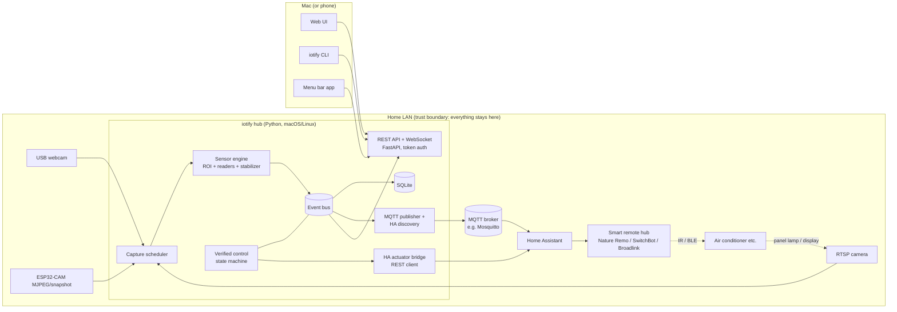
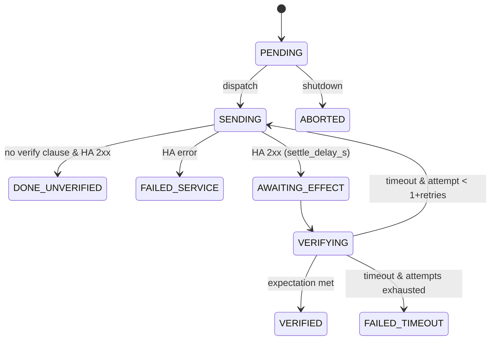
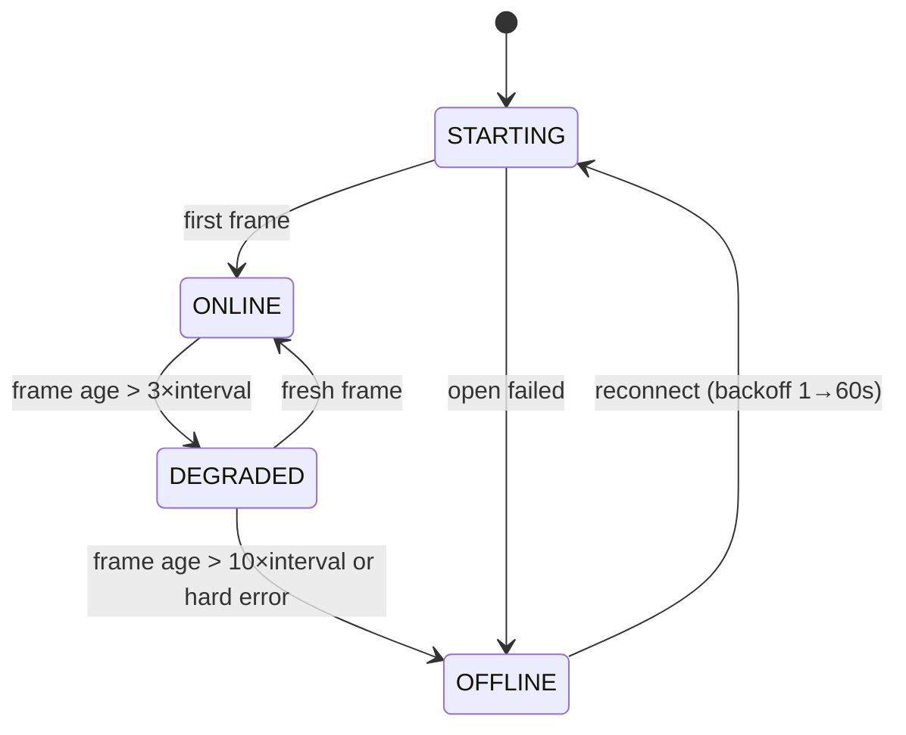
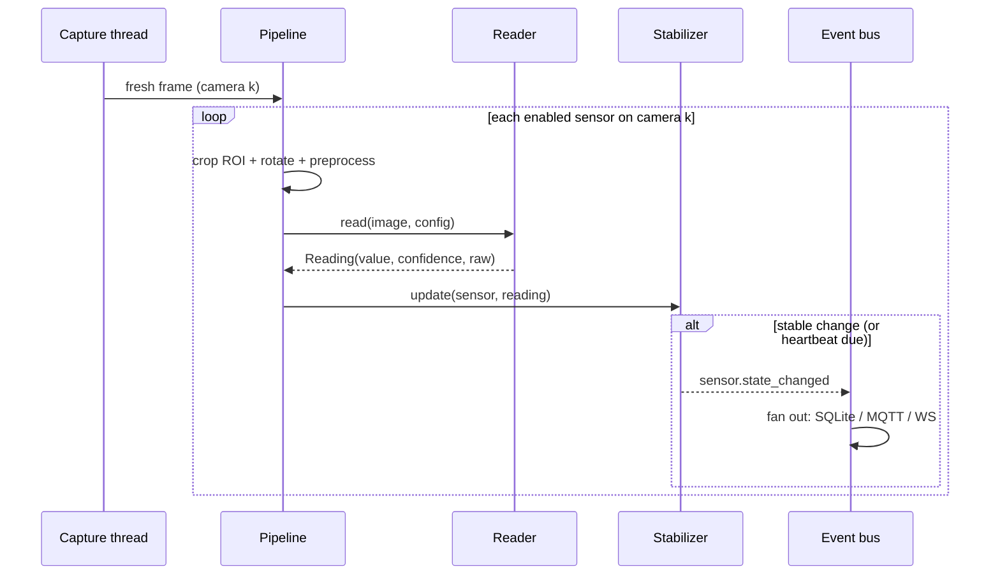

# iotify — v1 Design

Status: Draft for v1 implementation planning
Owner: Saber5656
Last updated: 2026-07-06
Related: [ISSUE_PLAN.md](./ISSUE_PLAN.md), [decisions/](./decisions/), [research/prior-art.md](./research/prior-art.md)

---

## 1. Product overview

**iotify** turns "dumb" household devices into connected devices **without any wiring**, using cameras as universal retrofit sensors and existing smart remote hubs as actuators.

A cheap camera (RTSP cam, USB webcam, ESP32-CAM, old phone running an MJPEG app) is pointed at a device's indicator lamps or digital display. iotify's local hub reads those analog states with **local-only computer vision**, publishes them as sensors to **MQTT / Home Assistant**, and lets the user **control** appliances from a Mac (Web UI, CLI, menu bar app) through Home Assistant-managed smart remotes (Nature Remo, SwitchBot Hub, Broadlink, etc.).

The differentiating capability is **camera-verified closed-loop control**: infrared and other retrofit actuation is open-loop (a command may silently fail), but iotify sends the command *and then watches the device with the camera* to confirm the state actually changed, retrying if it did not.

> "Did the AC actually turn on?" → iotify knows, because it is looking at it.

### 1.1 Example user stories

| # | Story |
|---|---|
| US-1 | Point a camera at the washing machine's "done" lamp; get a Home Assistant notification when laundry finishes. |
| US-2 | Point a camera at a water heater panel's 7-segment display; log the temperature and graph it. |
| US-3 | Turn on the air conditioner from the MacBook menu bar; iotify sends the IR command via Nature Remo through Home Assistant, then verifies via the camera that the AC panel lamp turned on, retrying up to 2 times. |
| US-4 | Point a camera at the mailbox; when the scene changes, publish a "mail arrived" event. |
| US-5 | Type `iotify appliance run living_ac power_on` in a terminal and watch verification progress. |

### 1.2 Positioning

See [research/prior-art.md](./research/prior-art.md). In one line: **AI-on-the-edge-device** digitizes one meter per dedicated ESP32; **Frigate** is an NVR focused on object detection; **iotify** is a *hub* that turns arbitrary cameras into many small retrofit sensors *and* closes the loop with retrofit actuators. iotify is explicitly **not** an NVR and does not record video.

---

## 2. Personas and environments

| Persona | Description | Needs |
|---|---|---|
| P-1 Maker / smart-home hobbyist | Runs Home Assistant + MQTT broker already, owns spare cameras | HA-native sensors, quick ROI setup, self-hosted, privacy |
| P-2 Mac-centric engineer | Wants to control/see home devices from the Mac they sit at all day | CLI, menu bar app, scriptability |
| P-3 Privacy-conscious household | Cameras inside the home are sensitive | Local-only processing, no cloud, clear retention rules |

Reference deployment targets:

| Target | Role |
|---|---|
| Raspberry Pi 4 (4GB) / Raspberry Pi 5, 64-bit Raspberry Pi OS (Debian Bookworm, Python 3.11) | Always-on hub (primary reference) |
| macOS 13+ (Apple Silicon) | Trial hub + client surfaces (Web UI, CLI, menu bar) |
| Docker (linux/amd64, linux/arm64) | Preferred distribution for always-on hubs |

---

## 3. Scope

### 3.1 v1 scope (must ship)

1. **Hub server** (Python) running on macOS and Linux.
2. **Camera sources**: RTSP, USB (V4L2/AVFoundation index), MJPEG HTTP stream, HTTP snapshot URL, and a file-based **replay** source (image directory / video file) used for tests and demos.
3. **Virtual sensors**: rectangular ROI on a camera frame + one reader:
   - `led` — lamp/LED on/off + coarse color,
   - `sevenseg` — 7-segment digit display to number,
   - `change` — generic scene-change detection.
4. **Stabilization**: debounce/hysteresis so flickery frames do not produce flapping states.
5. **Persistence**: SQLite (entities, readings history with retention, events, calibration images).
6. **Integrations**: MQTT publishing with Home Assistant MQTT Discovery; Home Assistant REST API client as the **actuator bridge**.
7. **Verified control**: appliance/action model targeting HA services with camera-based verification state machine.
8. **Surfaces**: Web UI (setup, ROI editor, dashboard, appliance control), CLI (`iotify`), macOS menu bar app (SwiftUI).
9. **Security baseline**: token auth, localhost-default bind, secrets file with 0600 permissions, no cloud egress, supply-chain CI (CodeQL, dependabot, audit).
10. **Packaging**: pip/PyPI package and multi-arch Docker image; documentation set.

### 3.2 v1 non-goals (explicitly out)

| Non-goal | Rationale / where it lives instead |
|---|---|
| Video recording / NVR / person detection | Frigate exists; iotify keeps at most single snapshots |
| Analog needle gauge reader | v2 (heavy calibration UI) |
| DIY IR blaster firmware | v2 (ESPHome-based guide); v1 actuates only via Home Assistant |
| Cloud VLM reading | Conflicts with local-only privacy posture; possible opt-in v2 |
| Multi-user accounts / RBAC | v1 is single-operator with one API token |
| Built-in TLS termination | Documented reverse-proxy guide instead |
| Windows support | Untested; macOS/Linux only |
| Home Assistant Add-on packaging | v2 |
| Signed/notarized menu bar binary distribution | v1 is build-from-source; notarization v2 |
| Blink-pattern (temporal) readers | v2; v1 readers are single-frame |
| Direct notifications (LINE/Slack/email) | Delegated to Home Assistant automations |

### 3.3 v2 deferred ideas

Analog gauge reader + calibration UI; ESPHome IR blaster reference build; opt-in cloud VLM reader (ROI-only, user API key); HA Add-on; notarized menu bar app with auto-update; blink/temporal readers; ONVIF camera discovery; Prometheus `/metrics`; sensor math/template values; image privacy masks; multi-hub federation.

---

## 4. System architecture



The dotted path `HA → remote → appliance → camera` is the physical feedback loop that verified control exploits.

### 4.1 Components

| Component | Language / stack | Ships as |
|---|---|---|
| Hub server (`iotify serve`) | Python 3.11+, FastAPI, uvicorn, OpenCV (`opencv-python-headless`), aiomqtt, aiosqlite, pydantic v2 | PyPI wheel + Docker image |
| Web UI | React 18 + TypeScript + Vite, built to static files served by the hub | embedded in wheel/image |
| CLI (`iotify …`) | Same Python package (Typer) | PyPI wheel |
| Menu bar app | Swift 5.9+, SwiftUI `MenuBarExtra`, macOS 13+ | build-from-source (SwiftPM) |

Stack rationale: [ADR-003](./decisions/ADR-003-technology-stack.md). Product-form rationale: [ADR-001](./decisions/ADR-001-local-hub-software-product.md). Actuation rationale: [ADR-002](./decisions/ADR-002-actuation-via-home-assistant.md).

### 4.2 Process model

Single process, asyncio event loop. Blocking work (OpenCV capture/decode, reader math, SQLite) runs in bounded thread executors:

| Executor | Size | Work |
|---|---|---|
| `capture` | 1 thread per enabled camera | frame grab loops |
| `analyze` | `max(2, cpu_count - 1)` | reader execution |
| (aiosqlite internal) | 1 per connection | DB I/O |

In-process **event bus** (`iotify.events.bus`): typed async pub/sub, topics = event kinds (§6.5). All cross-module communication (engine → MQTT/WS/DB, control → WS/MQTT) goes through the bus; modules never import each other's internals.

### 4.3 Repository layout (target)

```text
pyproject.toml            # hatchling, src layout
src/iotify/
  __init__.py             # __version__
  __main__.py             # python -m iotify
  cli/                    # Typer app: serve + client commands
  config/                 # pydantic models, loader, XDG paths
  logging_setup.py
  events/bus.py
  cameras/                # base.py, registry.py, rtsp.py, usb.py,
                          # mjpeg.py, snapshot.py, replay.py,
                          # scheduler.py, health.py
  sensing/                # types.py, preprocess.py, stabilizer.py,
                          # pipeline.py, readers/{base,led,sevenseg,change}.py
  storage/                # db.py, repos.py, retention.py, migrations/*.sql
  integrations/mqtt/      # client.py, topics.py, discovery.py
  control/                # ha_client.py, appliances.py, verify.py
  server/                 # app.py, auth.py, static/, api/*.py
web/                      # React app (Vite)
macos/IotifyMenuBar/      # SwiftPM package
tests/                    # unit/, integration/, e2e/, fixtures/images/
docs/
```

---

## 5. Filesystem, configuration, and secrets

### 5.1 Directories

| Purpose | Default | Override |
|---|---|---|
| Config dir | `$XDG_CONFIG_HOME/iotify` (fallback `~/.config/iotify`) | `--config-dir` / `IOTIFY_CONFIG_DIR` |
| Data dir | `$XDG_DATA_HOME/iotify` (fallback `~/.local/share/iotify`) | `--data-dir` / `IOTIFY_DATA_DIR` |

Data dir contents: `iotify.db` (SQLite, WAL), `snapshots/` (event + calibration images). The hub creates missing dirs with mode `0700`. Docker uses `/config` and `/data` volumes mapped to these.

### 5.2 `config.yaml` (infrastructure settings only)

Entities (cameras/sensors/appliances) live in SQLite and are managed via API/UI — **not** in YAML. `config.yaml` holds operator infrastructure settings:

```yaml
server:
  host: 127.0.0.1        # non-loopback logs a security warning
  port: 8799
mqtt:
  enabled: true
  host: 192.168.1.10
  port: 1883
  username: iotify       # password lives in secrets.yaml
  tls:
    enabled: false
    ca_cert: null        # paths; enables TLS validation when set
  base_topic: iotify
  discovery:
    enabled: true
    prefix: homeassistant
home_assistant:
  enabled: true
  base_url: "http://homeassistant.local:8123"   # token in secrets.yaml
storage:
  readings_retention_days: 90
  snapshot_retention_days: 7
logging:
  level: info            # debug|info|warning|error
```

Environment overrides: `IOTIFY_<SECTION>__<KEY>` (pydantic-settings style, `__` nesting). Unknown keys are rejected with a precise error (fail-fast at startup).

### 5.3 `secrets.yaml` (operator-managed, never written by the UI)

```yaml
api_token_sha256: "<hex>"   # written by `iotify token regenerate` / first run
mqtt_password: "..."
home_assistant_token: "..." # HA long-lived access token
```

Rules: file must be mode `0600` (hub refuses to start otherwise, with remediation hint); values are never logged (redaction filter, §12); the Web UI never displays or edits this file. Camera credentials entered through the UI are stored in SQLite (§6.1) — the DB file inherits `0600` inside a `0700` data dir; at-rest DB encryption is a documented v1 limitation.

Per operator policy, humans provision secrets (HA token, MQTT password); iotify docs give the steps but tooling never fetches or generates third-party credentials.

---

## 6. Domain model and data schemas

### 6.1 SQLite schema (migration `0001_init.sql`)

IDs are user-chosen slugs matching `^[a-z][a-z0-9_]{0,31}$` — they become MQTT topic and HA `unique_id` components and are immutable after creation. Timestamps are integer epoch **milliseconds UTC**.

```sql
CREATE TABLE cameras (
  id            TEXT PRIMARY KEY,
  name          TEXT NOT NULL,
  source_type   TEXT NOT NULL CHECK (source_type IN
                  ('rtsp','usb','mjpeg','snapshot','replay')),
  url           TEXT,              -- rtsp/mjpeg/snapshot/replay path
  device_index  INTEGER,           -- usb
  username      TEXT,
  password      TEXT,              -- see §5.3 note on at-rest limitation
  poll_interval_s REAL NOT NULL DEFAULT 2.0 CHECK (poll_interval_s >= 0.5),
  rotation      INTEGER NOT NULL DEFAULT 0 CHECK (rotation IN (0,90,180,270)),
  enabled       INTEGER NOT NULL DEFAULT 1,
  created_at    INTEGER NOT NULL,
  updated_at    INTEGER NOT NULL
);

CREATE TABLE sensors (
  id            TEXT PRIMARY KEY,
  camera_id     TEXT NOT NULL REFERENCES cameras(id) ON DELETE CASCADE,
  name          TEXT NOT NULL,
  reader_type   TEXT NOT NULL CHECK (reader_type IN ('led','sevenseg','change')),
  roi_x INTEGER NOT NULL, roi_y INTEGER NOT NULL,
  roi_w INTEGER NOT NULL CHECK (roi_w > 0),
  roi_h INTEGER NOT NULL CHECK (roi_h > 0),
  reader_config     TEXT NOT NULL DEFAULT '{}',  -- JSON, validated per type
  stabilizer_config TEXT NOT NULL DEFAULT '{}',  -- JSON
  ha_device_class   TEXT,          -- optional HA metadata
  unit              TEXT,
  enabled       INTEGER NOT NULL DEFAULT 1,
  created_at    INTEGER NOT NULL,
  updated_at    INTEGER NOT NULL
);

CREATE TABLE readings (
  id         INTEGER PRIMARY KEY AUTOINCREMENT,
  sensor_id  TEXT NOT NULL REFERENCES sensors(id) ON DELETE CASCADE,
  ts         INTEGER NOT NULL,
  value      TEXT NOT NULL,        -- JSON (§6.2)
  confidence REAL,
  raw        TEXT                  -- JSON reader debug payload, nullable
);
CREATE INDEX readings_sensor_ts ON readings(sensor_id, ts DESC);

CREATE TABLE events (
  id         INTEGER PRIMARY KEY AUTOINCREMENT,
  ts         INTEGER NOT NULL,
  kind       TEXT NOT NULL,        -- §6.5
  subject_id TEXT,
  payload    TEXT NOT NULL DEFAULT '{}'
);
CREATE INDEX events_ts   ON events(ts DESC);
CREATE INDEX events_kind ON events(kind, ts DESC);

CREATE TABLE appliances (
  id         TEXT PRIMARY KEY,
  name       TEXT NOT NULL,
  created_at INTEGER NOT NULL,
  updated_at INTEGER NOT NULL
);

CREATE TABLE appliance_actions (
  id            INTEGER PRIMARY KEY AUTOINCREMENT,
  appliance_id  TEXT NOT NULL REFERENCES appliances(id) ON DELETE CASCADE,
  name          TEXT NOT NULL,     -- slug, unique per appliance
  ha_domain     TEXT NOT NULL,     -- e.g. 'climate', 'remote'
  ha_service    TEXT NOT NULL,     -- e.g. 'set_temperature'
  target_entity TEXT NOT NULL,     -- e.g. 'climate.living_ac'
  service_data  TEXT NOT NULL DEFAULT '{}',  -- JSON template (§9.2)
  verify_sensor_id TEXT REFERENCES sensors(id) ON DELETE SET NULL,
  verify_expect    TEXT,           -- JSON expectation DSL (§9.3), nullable
  verify_timeout_s REAL NOT NULL DEFAULT 20,
  verify_retries   INTEGER NOT NULL DEFAULT 1,
  settle_delay_s   REAL NOT NULL DEFAULT 2,
  UNIQUE (appliance_id, name)
);

CREATE TABLE calibration_images (
  id         INTEGER PRIMARY KEY AUTOINCREMENT,
  sensor_id  TEXT NOT NULL REFERENCES sensors(id) ON DELETE CASCADE,
  label      TEXT NOT NULL,        -- 'baseline_off' | 'baseline_on' | 'reference'
  path       TEXT NOT NULL,        -- under <data>/snapshots/
  created_at INTEGER NOT NULL
);

CREATE TABLE schema_migrations (
  version    INTEGER PRIMARY KEY,
  applied_at INTEGER NOT NULL
);
```

Migrations: plain sequential SQL files `NNNN_name.sql` applied in a transaction at startup; no down-migrations in v1.

### 6.2 Reading value union (JSON in `readings.value` and MQTT `state`)

| Reader | Value JSON | Example |
|---|---|---|
| `led` | `{"state":"on"\|"off","color":<name\|null>,"brightness":0..1}` | `{"state":"on","color":"red","brightness":0.82}` |
| `sevenseg` | `{"number":<float\|null>,"text":"<digits>"}` (`null` when unreadable) | `{"number":26.5,"text":"26.5"}` |
| `change` | `{"state":"changed"\|"stable","magnitude":0..1}` | `{"state":"changed","magnitude":0.41}` |

### 6.3 Reader configs (`sensors.reader_config`, validated by pydantic per type)

```jsonc
// led
{ "mode": "brightness",            // "brightness" | "color"
  "on_threshold": 0.25,            // min mean-V delta vs baseline_off
  "color_bins": ["red","green","blue","yellow","orange","white"] }

// sevenseg
{ "digit_count": null,             // int | null = auto
  "decimal_places": null,          // int | null = auto-detect point
  "invert": false,                 // dark-on-light vs light-on-dark
  "allow_negative": false,
  "value_scale": 1.0,
  "min_confidence": 0.6 }

// change
{ "reference": "rolling_previous", // | "fixed_baseline"
  "blur_sigma": 2.0,
  "pixel_threshold": 25,           // 0-255 absdiff per pixel
  "area_threshold": 0.05,          // changed-pixel fraction
  "cooldown_s": 30,
  "save_snapshot": true }
```

### 6.4 Stabilizer config (`sensors.stabilizer_config`)

```jsonc
{ "window": 5,                // ring buffer of last N readings
  "agree": 3,                 // K of N must agree (mode for discrete)
  "deadband": 0.0,            // numeric: min |Δ| vs last reported
  "max_jump": null,           // numeric: reject single-frame outliers
  "min_report_interval_s": 0, // rate limit state reports
  "heartbeat_interval_s": 60  // persist/publish even without change
}
```

### 6.5 Event kinds (bus topics ≒ `events.kind`)

| Kind | Subject | Payload (JSON) |
|---|---|---|
| `sensor.state_changed` | sensor id | `{value, confidence, previous}` |
| `sensor.reading_persisted` | sensor id | `{value, confidence, ts}` — every persisted reading incl. heartbeats; bus-only (not written to `events`), consumed by MQTT publisher |
| `sensor.deleted` | sensor id | `{}` — emitted by the CRUD API; consumed by MQTT to clear retained topics |
| `appliance.updated` | appliance id | `{}` — CRUD notification for UI clients |
| `sensor.availability` | sensor id | `{available: bool, reason}` |
| `camera.health_changed` | camera id | `{state: "online"\|"degraded"\|"offline", detail}` |
| `verification.update` | run id | `{appliance_id, action, state, attempt}` (§9.4) |
| `system.started` / `system.stopping` | — | `{version}` |

Bus events are fanned out to: SQLite `events` table (except high-frequency internals), MQTT (§8), WebSocket (§7.4).

---

## 7. Hub server: API and auth

### 7.1 Authentication

- Single operator **API token**: 32 random bytes, base64url. Generated on first start, printed to stdout **once**; only `sha256(token)` is stored (`secrets.yaml`). `iotify token regenerate` (local command on the hub host) rotates it.
- All `/api/v1/**` routes require `Authorization: Bearer <token>` (constant-time hash compare). Exceptions: `GET /healthz` (liveness for Docker, returns `ok` only) and static Web UI assets.
- WebSocket auth: `POST /api/v1/system/ws-ticket` (authorized) returns `{ticket, expires_at}` — single-use, 60 s TTL, random 128-bit; connect `GET /api/v1/ws?ticket=…`. Avoids long-lived tokens in URLs/logs.
- Failed-auth rate limit: ≥10 failures/minute/IP → `429` with backoff (in-memory counter).
- Bind default `127.0.0.1`; binding non-loopback logs a prominent warning with hardening pointers. Auth cannot be disabled.
- Web UI stores the token in `localStorage` and sends Bearer headers (no cookies → no CSRF surface); strict CSP (§12) mitigates XSS.

### 7.2 REST API surface (`/api/v1`, JSON; errors follow RFC 9457 problem+json)

| Method + path | Purpose |
|---|---|
| `GET /system/info` | version, uptime, counts, data dir sizes |
| `POST /system/ws-ticket` | mint WebSocket ticket |
| `GET /healthz` *(no auth)* | liveness `ok` |
| `GET·POST /cameras`, `GET·PUT·DELETE /cameras/{id}` | camera CRUD (password write-only; never echoed) |
| `POST /cameras/{id}/test` | connectivity check → health detail |
| `GET /cameras/{id}/snapshot?fresh=` | latest/fresh JPEG frame |
| `GET·POST /sensors`, `GET·PUT·DELETE /sensors/{id}` | sensor CRUD |
| `GET /sensors/{id}/preview` | current ROI crop JPEG |
| `POST /sensors/{id}/test-read` | run reader once → reading + debug artifacts (base64 intermediate images when `?debug=1`) |
| `POST /sensors/{id}/calibrate` | capture calibration image `{label}` |
| `GET /sensors/{id}/readings?from&to&limit&downsample=` | history (max-N per bucket downsampling) |
| `GET /readings/latest` | latest stable reading per sensor |
| `GET /events?kind&from&to&limit` | event log |
| `GET·POST /appliances`, `GET·PUT·DELETE /appliances/{id}` | appliance CRUD (actions nested in body) |
| `POST /appliances/{id}/actions/{name}/run` | `{params?, verify?:bool}` → `202 {run_id}` or `409` if busy |
| `GET /appliances/runs/{run_id}` | verification run status |
| `GET /ha/entities?domain=` / `GET /ha/services` | proxied HA catalogs for UI pickers |

OpenAPI schema served at `/api/v1/openapi.json` (auth-gated).

### 7.3 ID and input validation rules

- Entity ids: `^[a-z][a-z0-9_]{0,31}$`, immutable, globally unique per table.
- Camera URLs: scheme allowlist `rtsp|http|https` (`replay` accepts repo-relative or absolute file paths); `file://` and other schemes rejected. Private-range IPs are expected (LAN product) and allowed by design.
- ROI must lie inside the camera frame at validation time; re-validated at read time (frame size change → `sensor.availability false, reason:"roi_out_of_bounds"`).
- All request bodies validated by pydantic with `extra="forbid"`.

### 7.4 WebSocket stream

`GET /api/v1/ws?ticket=…` → server pushes JSON messages `{type, ts, data}` with `type ∈ {sensor_update, sensor_availability, camera_status, event, verification_update, hello, ping}`. Client → server: `{"type":"ping"}` only. Heartbeat every 20 s; server closes on 60 s silence. Slow consumers: per-connection bounded queue (256), drop-oldest with a `gap: true` marker.

---

## 8. MQTT and Home Assistant integration

### 8.1 Topic schema

All topics are under configured `mqtt.base_topic` (default `iotify`). The table below uses `<base_topic>` to avoid treating the default as a hard-coded prefix.

| Topic | Retain | Payload |
|---|---|---|
| `<base_topic>/bridge/status` | yes (LWT) | `online` / `offline` |
| `<base_topic>/sensor/<id>/state` | yes | reading JSON (§6.2) + `{"confidence":…,"ts":…}` |
| `<base_topic>/sensor/<id>/availability` | yes | `online` / `offline` |
| `<base_topic>/camera/<id>/status` | yes | `{"state":"online"…}` |
| `<base_topic>/appliance/<id>/result` | no | verification outcome JSON (§9.4) |

QoS 1 for state/availability; client id `iotify-<hostid>`; automatic reconnect with exponential backoff (1→60 s, jitter); session-expiry so retained availability stays coherent with LWT.

### 8.2 Home Assistant MQTT Discovery

For each enabled sensor, publish a retained discovery config under `<prefix>/<component>/iotify_<sensor_id>/config`:

| Reader | HA component | Mapping |
|---|---|---|
| `led` | `binary_sensor` | `value_template` on `state`; `device_class` from sensor config |
| `sevenseg` | `sensor` | numeric `value_template` on `number`; `unit_of_measurement`, `state_class: measurement` |
| `change` | `binary_sensor` (`device_class: motion`-like, configurable) | `state` mapping with `off_delay` derived from cooldown |

Common fields: stable `unique_id` (`iotify_<sensor_id>`), `availability` (bridge + sensor topics, `availability_mode: all`), `device` block grouping sensors per camera (`identifiers: ["iotify_cam_<camera_id>"]`, `via_device: "iotify_hub_<hostid>"`), `origin` metadata. Sensor deletion/disable publishes an empty retained payload to remove the discovery entry. Exact payload contract pinned against the HA MQTT Discovery documentation at implementation time.

### 8.3 HA actuator bridge (REST client)

- Config: `home_assistant.base_url` + long-lived token (secrets). Operator guidance: create a **dedicated HA user** for iotify to limit blast radius.
- Used endpoints: `GET /api/` (handshake), `GET /api/states` (+ single entity), `POST /api/services/<domain>/<service>`.
- Timeouts 10 s; retries only for idempotent GETs; service calls are **not** blindly retried at HTTP level (retry policy belongs to the verification state machine).
- Error taxonomy surfaced to callers: `ha_unreachable`, `ha_auth_failed`, `ha_service_error(status, message)`.

---

## 9. Verified control

### 9.1 Model

An **appliance** groups named **actions**. An action = one HA service call + optional verification clause referencing a sensor.

```jsonc
// POST /api/v1/appliances body (actions embedded)
{ "id": "living_ac", "name": "Living room AC",
  "actions": [
    { "name": "power_on",
      "ha_domain": "climate", "ha_service": "turn_on",
      "target_entity": "climate.living_ac",
      "service_data": {},
      "verify": { "sensor_id": "ac_panel_led",
                  "expect": {"state_equals": "on"},
                  "timeout_s": 20, "retries": 2, "settle_delay_s": 2 } },
    { "name": "set_temp",
      "ha_domain": "climate", "ha_service": "set_temperature",
      "target_entity": "climate.living_ac",
      "service_data": {"temperature": "{{params.temperature}}"} }
  ] }
```

### 9.2 Parameter templating

`service_data` values may contain `{{params.<key>}}` placeholders substituted from the run request's `params` object. Substitution is **strict string/number replacement only** (no expression language, no nested lookup) — a deliberately tiny surface; unknown placeholders → `400`.

Client surfaces keep parameter form state string-based in v1 (Web UI, CLI, and menu bar all submit strings), and the server owns deterministic coercion before rendering `service_data`. Each declared parameter has server-returned metadata (`type: "string" | "number"`, default `"string"`) derived from action configuration; placeholders for numeric HA service fields must render JSON numbers, not quoted numeric strings.

### 9.3 Expectation DSL (`verify_expect`)

Exactly one key per expectation:

| Key | Applies to | Meaning |
|---|---|---|
| `state_equals: "<s>"` | led/change | stable state equals |
| `number_gte / number_lte: <x>` | sevenseg | stable number compares |
| `number_between: [a,b]` | sevenseg | inclusive range |
| `changed_within_s: <n>` | change | a change event observed within n seconds of dispatch |

### 9.4 Run state machine



Rules: one in-flight run per appliance (else `409 busy`); every transition emits `verification.update` on the bus (→ WS + `events` table), and the MQTT publisher converts terminal transitions into `<base_topic>/appliance/<id>/result`; expectation evaluation consumes **stable** (post-stabilizer) readings only; `run_id` = UUIDv4; runs are kept in memory and mirrored to `events` (no dedicated table in v1).

Failure modes documented for implementers: HA reachable but wrong entity (`FAILED_SERVICE` with HA message), camera offline during verify (fail fast with `reason: sensor_unavailable`), sensor deleted mid-run (abort), hub restart (in-flight runs are lost; MQTT result not sent — documented limitation).

---

## 10. Sensing pipeline details

### 10.1 Capture scheduler and camera health

Per enabled camera: a capture thread grabs a frame every `poll_interval_s` into a latest-frame cache `{camera_id: (frame, ts)}`; analysis is triggered on fresh frames only.



Health transitions emit `camera.health_changed`; sensor availability follows its camera.

### 10.2 Frame → reading flow



Readers are pure functions `read(image: np.ndarray, config) -> Reading` — no I/O, no state — which keeps them unit-testable against golden images. Low-confidence readings (`< min_confidence`) become `sensor.availability(false, reason:"unreadable")` after `window` consecutive failures, not bogus values.

### 10.3 Performance budget (reference: Raspberry Pi 4, 4GB)

| Metric | Budget |
|---|---|
| Concurrent cameras / sensors | 4 cameras @ 0.5–2 s interval, 12 sensors |
| Reader latency @ ROI ≤ 640×480 | led < 20 ms, change < 30 ms, sevenseg < 150 ms |
| Steady-state CPU | < 60 % of one core per camera stream at 0.5 fps analysis |
| RSS | < 500 MB total |
| Reading write rate | ≤ 5 rows/s sustained (WAL mode) |

---

## 11. Client surfaces

### 11.1 Web UI (React SPA served by hub)

Pages: **Login** (token entry) → **Dashboard** (live sensor tiles, sparklines, event feed) / **Cameras** (CRUD, live snapshot, health) / **Sensor editor** (snapshot canvas: draw/resize ROI rectangle; reader type + config form; calibration capture buttons; live test-read panel with debug images) / **Appliances** (CRUD, action buttons with param forms, verification progress timeline) / **Events** / **Settings** (read-only infra config, version, token rotation instructions). Mobile-friendly layout (the phone is a natural second screen), Japanese/English i18n scaffold with English strings in v1.

### 11.2 CLI

`iotify` (same package): `serve`, `token regenerate` (hub-local); client commands (hub URL/token from `~/.config/iotify/cli.toml`, `IOTIFY_HUB_URL`/`IOTIFY_TOKEN` env, or flags): `status`, `camera list`, `camera snapshot <id> -o out.jpg`, `sensor list`, `sensor read <id>`, `sensor watch [<id>]` (WS live), `appliance list`, `appliance run <appliance> <action> [--param k=v]* [--no-verify] [--wait]`, `events tail`, `entities export/import` (JSON backup of cameras/sensors/appliances). Output: human tables by default, `--json` for scripts; exit codes 0 ok / 1 error / 2 verification failed.

### 11.3 macOS menu bar app

SwiftUI `MenuBarExtra` (macOS 13+), SwiftPM project in `macos/IotifyMenuBar/`. Menu: sensor section (name, latest value, staleness dot), appliance actions (click to run; confirmation for destructive-flagged actions), verification progress (spinner → ✓/✗ + `UserNotifications` on terminal state), "Open Web UI", Settings (hub URL; token stored in **Keychain**), launch-at-login via `SMAppService`. Transport: REST polling (5 s) + WS ticket stream where available. v1 distribution: build from source (`swift build` / Xcode); signing/notarization is a v2 item.

---

## 12. Security model

Full ADR: [ADR-004](./decisions/ADR-004-security-posture.md). Principles: **local-only by default, authenticated by default, no silent egress, smallest credential blast radius we can manage in v1.**

### 12.1 Assets

| Asset | Sensitivity |
|---|---|
| Camera frames / snapshots (home interior imagery) | High (privacy) |
| HA long-lived token | High (controls the whole home) |
| iotify API token | High (controls iotify + indirect HA services) |
| MQTT credentials | Medium |
| Camera credentials | Medium |
| Readings/events history | Medium (behavioral patterns) |

### 12.2 Trust boundaries and threat table

| # | Boundary / threat | v1 mitigation | Residual risk |
|---|---|---|---|
| T1 | LAN attacker → hub API | Bearer token on every route, localhost default bind, failed-auth rate limit, CSP/security headers, no CORS by default | LAN sniffing of plain HTTP → reverse-proxy TLS guide; accepted for v1 |
| T2 | LAN attacker → MQTT | TLS + username/password support; docs require broker auth | Broker misconfig is user-owned |
| T3 | Malicious/compromised camera feeds crafted streams (decoder attack surface: ffmpeg/OpenCV/JPEG) | Content-type & size caps (snapshot ≤ 8 MiB), read timeouts, decode errors quarantine the camera (OFFLINE), dependencies pinned + dependabot | In-process decoding; sandboxed decode is a v2 known unknown |
| T4 | Theft of config/DB files | `0700` dirs, `0600` files enforced at startup; token stored hashed | No at-rest encryption in v1 (documented) |
| T5 | HA token abuse via iotify compromise | Dedicated HA user recommended; iotify calls only `/api/states` + `/api/services/**`; token never logged/echoed | HA tokens are coarse-grained by design |
| T6 | Malicious Web UI input (XSS → token theft) | React escaping, strict CSP (`default-src 'self'`), no inline scripts, no external origins | localStorage token accepted for v1 (documented trade-off vs CSRF) |
| T7 | Supply chain (PyPI/npm/actions) | Lockfiles, dependabot, CodeQL, `pip-audit`/`npm audit` in CI, GitHub Actions pinned to SHAs, least-privilege workflow permissions | Zero-days remain |
| T8 | Hub exposed to the internet by user | Refuse-to-be-quiet: startup warning on non-loopback bind, docs forbid port-forwarding, no UPnP, secure-defaults doc | User override is user-owned |
| T9 | Household privacy (people in frame) | No video recording; snapshots only for calibration/change events; retention defaults (7 d snapshots / 90 d readings); privacy doc section | Camera placement is a human decision |

### 12.3 Cross-cutting rules for every implementation issue

1. No endpoint, topic, or file write is added without stating its auth/validation story.
2. Secrets: never logged (redaction filter matches known secret keys and token patterns), never returned by APIs (camera `password` is write-only), never committed (`.gitignore` + example files).
3. All external inputs (camera bytes, MQTT connect acks, HA responses, API bodies) are parsed with explicit size/type/schema limits; failures are contained per-entity (one bad camera never crashes the hub).
4. Outbound network connections are limited to: configured cameras, configured MQTT broker, configured HA base URL. Anything else is a bug (and a test asserts the httpx/aiomqtt client factories are the only egress points).
5. Dependencies: pinned via lockfile (`uv.lock` / `package-lock.json` / `Package.resolved`); adding a dependency requires a rationale line in the PR.

---

## 13. Observability and diagnostics

- Structured logging (std `logging` + JSON formatter option), per-module loggers, `logging.level` config; secrets redaction filter installed at root.
- `GET /system/info` exposes: version, uptime, camera health map, per-sensor last-read age, MQTT/HA connection state, DB size, queue depths.
- Event log doubles as an audit trail: every appliance run (who: token — single operator; what; outcome) is an event.
- Debug bundle: `iotify diag` CLI collects versions, config (secrets stripped), health snapshot into a tarball for bug reports (no images unless `--include-snapshots`).

---

## 14. Testing and validation strategy

| Layer | Tooling | Gate |
|---|---|---|
| Python unit | pytest + golden image fixtures (`tests/fixtures/images/`) | CI, per PR; readers must hit per-issue accuracy targets |
| Type/lint | mypy (strict on new code), ruff | CI |
| Integration | pytest + Mosquitto service container + replay cameras + **stub HA server** (tiny FastAPI app mimicking `/api/states`, `/api/services`) | CI |
| Web UI | vitest (units), `tsc --noEmit`, eslint; Playwright smoke (login → dashboard renders) | CI |
| Swift | `swift build` + XCTest for API client/model layer | CI (macOS runner) |
| E2E scenario | docker compose profile: hub + mosquitto + stub-HA + replay cameras; scripted assertions (discovery appears → LED state flows → verified run succeeds → retry path on stubbed failure) | CI (linux) + release checklist |
| Manual QA | Documented checklist with a real camera + real HA (release gate) | pre-release |

Fixture corpus: committed real photos + synthetic renders for `led` (on/off/colors/glare), `sevenseg` (0–9, minus, decimal, glare, skew), `change` (sequences). Every reader bug fix adds a fixture (regression ratchet).

---

## 15. Delivery plan

Implementation is sliced into 9 waves × 41 granular issues — see [ISSUE_PLAN.md](./ISSUE_PLAN.md) for the ordered list, dependency table, coverage map, and validation plan. Wave summary:

| Wave | Theme | Issues |
|---|---|---|
| 0 | Foundation (scaffold, config, logging, DB, CI) | 01–05 |
| 1 | Camera ingestion | 06–09 |
| 2 | Sensor engine (readers, stabilizer, pipeline) | 10–15 |
| 3 | API & auth | 16–19 |
| 4 | MQTT/HA integration & verified control | 20–24 |
| 5 | Web UI | 25–30 |
| 6 | CLI | 31–32 |
| 7 | macOS menu bar app | 33–35 |
| 8 | Security hardening, packaging, docs, E2E | 36–41 |

---

## 16. Known unknowns and risks

| # | Unknown | Trigger for new issues |
|---|---|---|
| K1 | 7-seg accuracy across real devices (glare, viewing angle, LCD polarization) | If fixture accuracy < target with classical CV → add tiny-CNN reader issue (v1.x) |
| K2 | RTSP stack quirks across camera brands (OpenCV/ffmpeg options) | Field reports → per-camera option matrix issue |
| K3 | HA MQTT Discovery / REST contract drift | Pin against current HA docs at implementation; contract tests catch drift |
| K4 | aiomqtt reconnect edge cases under broker restart | Integration test findings may force a paho-mqtt fallback |
| K5 | Swift CI runner + WS stability in MenuBarExtra | May downgrade menu bar transport to polling-only in v1 |
| K6 | OpenCV wheel availability/performance on arm64 (Pi) | Docker baseline mitigates; may add piwheels doc note |
| K7 | SQLite growth under aggressive polling | Retention defaults may need tightening; consider downsampling job |
| K8 | Menu bar distribution demand (signing/notarization) | v2 issue if build-from-source proves too high-friction |
| K9 | License final call (Apache-2.0 default, human to confirm before public release) | Confirm before first tagged release |
