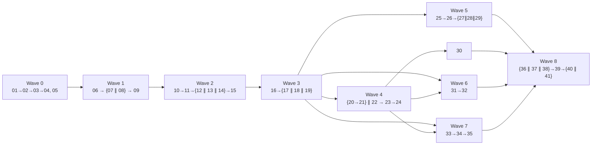

# iotify — v1 Issue Plan

Status: Ready for implementation
Source design: [DESIGN.md](./DESIGN.md) · Issue drafts: [issues/](./issues/) · Decisions: [decisions/](./decisions/)
Last updated: 2026-07-06

---

## 1. v1 completion statement

**v1 is complete when all 41 issues below are completed and validated** — each issue's Acceptance Criteria met and its Validation section executed — **and** the E2E suite (issue 41) is green with the release checklist (issue 40) executed once against the final build.

At that point the product defined in DESIGN §3.1 exists in full: a user can install iotify via pip or Docker on macOS/Linux; onboard RTSP/USB/MJPEG/snapshot/replay cameras; define `led`/`sevenseg`/`change` sensors with ROI, calibration, and stabilization; see those sensors appear automatically in Home Assistant via MQTT Discovery; watch live values and history on the Web UI dashboard; and run **camera-verified appliance control** (via Home Assistant actuators) from the Web UI, the `iotify` CLI, and the macOS menu bar app — under the ADR-004 security posture (local-only, authenticated, hardened supply chain) with a complete documentation set.

The only intentional remainder after issue 41 is the human-approved act of publishing the first release (`v0.1.0` tag approval, PyPI/GHCR publication — runbook in issue 39) and the human license confirmation (K9).

No v1 product behavior lives outside this plan: every DESIGN.md commitment maps to at least one issue (coverage table, §5).

## 2. Issue list in recommended execution order

| # | Issue file | Title (short) | Wave | GitHub |
|---|---|---|---|---|
| 01 | [01-repo-scaffold-python-package.md](./issues/01-repo-scaffold-python-package.md) | Python package scaffold + tooling | 0 | [#1](https://github.com/Saber5656/iotify/issues/1) |
| 02 | [02-config-schema-and-loader.md](./issues/02-config-schema-and-loader.md) | Config schema, loader, XDG paths | 0 | [#2](https://github.com/Saber5656/iotify/issues/2) |
| 03 | [03-logging-and-redaction.md](./issues/03-logging-and-redaction.md) | Logging + secrets redaction | 0 | [#3](https://github.com/Saber5656/iotify/issues/3) |
| 04 | [04-sqlite-persistence-and-migrations.md](./issues/04-sqlite-persistence-and-migrations.md) | SQLite layer, migrations, retention | 0 | [#4](https://github.com/Saber5656/iotify/issues/4) |
| 05 | [05-ci-github-actions.md](./issues/05-ci-github-actions.md) | Core CI workflow | 0 | [#5](https://github.com/Saber5656/iotify/issues/5) |
| 06 | [06-camera-source-interface-and-replay-source.md](./issues/06-camera-source-interface-and-replay-source.md) | CameraSource contract + replay source | 1 | [#6](https://github.com/Saber5656/iotify/issues/6) |
| 07 | [07-rtsp-and-usb-camera-sources.md](./issues/07-rtsp-and-usb-camera-sources.md) | RTSP + USB sources | 1 | [#7](https://github.com/Saber5656/iotify/issues/7) |
| 08 | [08-mjpeg-and-snapshot-http-sources.md](./issues/08-mjpeg-and-snapshot-http-sources.md) | MJPEG + snapshot HTTP sources | 1 | [#8](https://github.com/Saber5656/iotify/issues/8) |
| 09 | [09-capture-scheduler-and-camera-health.md](./issues/09-capture-scheduler-and-camera-health.md) | Capture scheduler + health SM + event bus | 1 | [#9](https://github.com/Saber5656/iotify/issues/9) |
| 10 | [10-roi-extraction-and-preprocessing.md](./issues/10-roi-extraction-and-preprocessing.md) | ROI/preprocess utils + fixture corpus | 2 | [#10](https://github.com/Saber5656/iotify/issues/10) |
| 11 | [11-reader-plugin-interface.md](./issues/11-reader-plugin-interface.md) | Reader interface + config models | 2 | [#11](https://github.com/Saber5656/iotify/issues/11) |
| 12 | [12-led-lamp-state-reader.md](./issues/12-led-lamp-state-reader.md) | LED/lamp reader | 2 | [#12](https://github.com/Saber5656/iotify/issues/12) |
| 13 | [13-seven-segment-digit-reader.md](./issues/13-seven-segment-digit-reader.md) | Seven-segment reader | 2 | [#13](https://github.com/Saber5656/iotify/issues/13) |
| 14 | [14-change-detection-reader.md](./issues/14-change-detection-reader.md) | Change-detection reader | 2 | [#14](https://github.com/Saber5656/iotify/issues/14) |
| 15 | [15-stabilizer-and-sensor-pipeline.md](./issues/15-stabilizer-and-sensor-pipeline.md) | Stabilizer + sensor pipeline | 2 | [#15](https://github.com/Saber5656/iotify/issues/15) |
| 16 | [16-fastapi-skeleton-and-token-auth.md](./issues/16-fastapi-skeleton-and-token-auth.md) | FastAPI skeleton + token auth + serve | 3 | [#16](https://github.com/Saber5656/iotify/issues/16) |
| 17 | [17-rest-api-cameras-and-sensors.md](./issues/17-rest-api-cameras-and-sensors.md) | REST: cameras + sensors | 3 | [#17](https://github.com/Saber5656/iotify/issues/17) |
| 18 | [18-rest-api-readings-and-events.md](./issues/18-rest-api-readings-and-events.md) | REST: readings + events | 3 | [#18](https://github.com/Saber5656/iotify/issues/18) |
| 19 | [19-websocket-live-updates.md](./issues/19-websocket-live-updates.md) | WebSocket live updates + tickets | 3 | [#19](https://github.com/Saber5656/iotify/issues/19) |
| 20 | [20-mqtt-client-and-topic-schema.md](./issues/20-mqtt-client-and-topic-schema.md) | MQTT client + topics + publishing | 4 | [#20](https://github.com/Saber5656/iotify/issues/20) |
| 21 | [21-home-assistant-mqtt-discovery.md](./issues/21-home-assistant-mqtt-discovery.md) | HA MQTT Discovery | 4 | [#21](https://github.com/Saber5656/iotify/issues/21) |
| 22 | [22-home-assistant-actuator-bridge.md](./issues/22-home-assistant-actuator-bridge.md) | HA actuator bridge (REST client) | 4 | [#22](https://github.com/Saber5656/iotify/issues/22) |
| 23 | [23-appliance-model-and-actions-api.md](./issues/23-appliance-model-and-actions-api.md) | Appliance/actions model + API | 4 | [#23](https://github.com/Saber5656/iotify/issues/23) |
| 24 | [24-verified-control-state-machine.md](./issues/24-verified-control-state-machine.md) | Verified-control state machine + run API | 4 | [#24](https://github.com/Saber5656/iotify/issues/24) |
| 25 | [25-webui-scaffold-and-build-integration.md](./issues/25-webui-scaffold-and-build-integration.md) | Web UI scaffold + build integration | 5 | [#25](https://github.com/Saber5656/iotify/issues/25) |
| 26 | [26-webui-auth-and-api-client.md](./issues/26-webui-auth-and-api-client.md) | Web UI auth + typed API/WS client | 5 | [#26](https://github.com/Saber5656/iotify/issues/26) |
| 27 | [27-webui-camera-management.md](./issues/27-webui-camera-management.md) | Web UI camera management | 5 | [#27](https://github.com/Saber5656/iotify/issues/27) |
| 28 | [28-webui-roi-editor-and-sensor-config.md](./issues/28-webui-roi-editor-and-sensor-config.md) | Web UI ROI editor + sensor config | 5 | [#28](https://github.com/Saber5656/iotify/issues/28) |
| 29 | [29-webui-dashboard.md](./issues/29-webui-dashboard.md) | Web UI dashboard + events | 5 | [#29](https://github.com/Saber5656/iotify/issues/29) |
| 30 | [30-webui-appliance-control-panel.md](./issues/30-webui-appliance-control-panel.md) | Web UI appliance control panel | 5 | [#30](https://github.com/Saber5656/iotify/issues/30) |
| 31 | [31-cli-core-and-read-commands.md](./issues/31-cli-core-and-read-commands.md) | CLI core + read commands + diag | 6 | [#31](https://github.com/Saber5656/iotify/issues/31) |
| 32 | [32-cli-appliance-control.md](./issues/32-cli-appliance-control.md) | CLI appliance control | 6 | [#32](https://github.com/Saber5656/iotify/issues/32) |
| 33 | [33-menubar-app-scaffold.md](./issues/33-menubar-app-scaffold.md) | Menu bar app scaffold | 7 | [#33](https://github.com/Saber5656/iotify/issues/33) |
| 34 | [34-menubar-sensor-status.md](./issues/34-menubar-sensor-status.md) | Menu bar sensor status | 7 | [#34](https://github.com/Saber5656/iotify/issues/34) |
| 35 | [35-menubar-appliance-controls.md](./issues/35-menubar-appliance-controls.md) | Menu bar appliance controls + notifications | 7 | [#35](https://github.com/Saber5656/iotify/issues/35) |
| 36 | [36-secrets-handling-and-server-hardening.md](./issues/36-secrets-handling-and-server-hardening.md) | Security hardening pass + guards | 8 | [#36](https://github.com/Saber5656/iotify/issues/36) |
| 37 | [37-supply-chain-security-ci.md](./issues/37-supply-chain-security-ci.md) | Supply-chain security automation | 8 | [#37](https://github.com/Saber5656/iotify/issues/37) |
| 38 | [38-docker-packaging.md](./issues/38-docker-packaging.md) | Docker packaging | 8 | [#38](https://github.com/Saber5656/iotify/issues/38) |
| 39 | [39-pypi-packaging-and-release.md](./issues/39-pypi-packaging-and-release.md) | PyPI packaging + release workflow | 8 | [#39](https://github.com/Saber5656/iotify/issues/39) |
| 40 | [40-documentation-and-guides.md](./issues/40-documentation-and-guides.md) | Documentation set | 8 | [#40](https://github.com/Saber5656/iotify/issues/40) |
| 41 | [41-e2e-integration-test-suite.md](./issues/41-e2e-integration-test-suite.md) | E2E scenario suite | 8 | [#41](https://github.com/Saber5656/iotify/issues/41) |

GitHub issue numbers match the file numbers 1:1 (created 2026-07-06 in order on the fresh repository).

## 3. Dependency table

`Hard` = must be merged first. `Soft` = enriches but does not block (stated per issue).

| Issue | Hard dependencies | Soft / coordination |
|---|---|---|
| 01 | — | — |
| 02 | 01 | — |
| 03 | 01, 02 | — |
| 04 | 01, 02, 03 | — |
| 05 | 01 | runs 02–04 tests once merged |
| 06 | 01, 02, 03, 04 | — |
| 07 | 06 | — |
| 08 | 06 | — |
| 09 | 03, 04, 06 | 07/08 plug in transparently |
| 10 | 01–04, 06 | — |
| 11 | 04, 10 | — |
| 12 | 10, 11 | — |
| 13 | 10, 11 | — |
| 14 | 10, 11 | — |
| 15 | 04, 09, 10, 11, 12, 13, 14 | — |
| 16 | 02, 03, 04, 09, 15 | — |
| 17 | 04, 09, 11, 15, 16 | — |
| 18 | 04, 15, 16 | — |
| 19 | 09, 15, 16 | — |
| 20 | 02, 03, 05, 09, 15 | 17 (sensor.deleted events) |
| 21 | 17, 20 | 40 (guide expansion) |
| 22 | 02, 03, 16 | — |
| 23 | 04, 16, 17, 22 | — |
| 24 | 15, 19, 20, 22, 23 | 41 reuses its stub HA |
| 25 | 05, 16 | 38/39 consume its build |
| 26 | 16, 19, 25 | — |
| 27 | 17, 26 | — |
| 28 | 11, 15, 17, 26 | — |
| 29 | 18, 19, 26 | 28 (sensors to show) |
| 30 | 19, 23, 24, 26 | — |
| 31 | 16, 17, 18, 19 | 36 (diag leak check) |
| 32 | 23, 24, 31 | — |
| 33 | 16, 19 | — |
| 34 | 18, 19, 33 | — |
| 35 | 23, 24, 33, 34 | — |
| 36 | 16, 17, 19, 20, 22, 25, 26, 31, 33 | files follow-ups if structural |
| 37 | 05, 25, 33 | — |
| 38 | 01, 16, 25 | 39 (shared hatch build hook) |
| 39 | 01, 05, 25, 37, 38 | human: PyPI trusted publisher |
| 40 | 21, 27–35, 38, 39 | consolidates PR evidence |
| 41 | 06, 09, 15, 21, 24, 32, 38 | release gate with 40 |

### Parallelism guide (mermaid)

## 4. Implementation waves

| Wave | Theme | Issues | Exit gate |
|---|---|---|---|
| 0 | Foundation | 01–05 | CI green on macOS+Linux; `iotify version` works |
| 1 | Camera ingestion | 06–09 | Replay+real sources deliver frames; health SM verified with fake clocks |
| 2 | Sensor engine | 10–15 | Reader accuracy targets met on corpus; pipeline E2E (replay→bus→DB) green |
| 3 | API & auth | 16–19 | Booted hub: auth, CRUD, history, WS all integration-tested |
| 4 | Integrations & control | 20–24 | Discovery visible to a broker subscriber; verified-control happy/retry paths green vs stub HA |
| 5 | Web UI | 25–30 | Manual flows recorded: onboard camera → sensor → dashboard → verified run |
| 6 | CLI | 31–32 | CLI matrix green incl. exit codes; NDJSON goldens |
| 7 | Menu bar app | 33–35 | Build-from-source on clean Mac; live values + verified-run notification demos |
| 8 | Hardening & release | 36–41 | Security suites green; dry-run release; docs quickstart timed; E2E ×3 stable |

Waves 5 / 6 / 7 can proceed in parallel once waves 3–4 land (independent surfaces over the same API).

## 5. Coverage table (DESIGN.md section → issues)

| DESIGN section | Covered by issues |
|---|---|
| §1 Product overview / user stories US-1–US-5 | 41 (scenario mapping), all |
| §2 Personas & environments | 38 (Pi/Docker), 33–35 (Mac), 40 (docs) |
| §3 Scope / non-goals | this plan; §7/§8 below (v2, unknowns) |
| §4.1 Components | 01, 25, 31, 33 |
| §4.2 Process model (executors, bus) | 09, 15, 16 |
| §4.3 Repository layout | 01 |
| §5.1 Directories | 02, 38 |
| §5.2 config.yaml | 02, 16 (`trust_proxy`) |
| §5.3 secrets.yaml & policy | 02, 16, 36 |
| §6.1 SQLite schema | 04 |
| §6.2 Reading value union | 11–14, 20 |
| §6.3 Reader configs | 11, 12, 13, 14, 28 |
| §6.4 Stabilizer config | 15, 28 |
| §6.5 Event kinds | 09, 15, 17, 19, 20, 24 |
| §7.1 Authentication | 16, 19, 26, 31, 33 |
| §7.2 REST surface | 16, 17, 18, 23, 24 |
| §7.3 Validation rules | 17, 23 |
| §7.4 WebSocket | 19, 26, 31, 34 |
| §8.1 MQTT topics | 20 |
| §8.2 HA Discovery | 21 |
| §8.3 HA actuator bridge | 22 |
| §9.1–9.3 Appliance model / templating / expectation DSL | 23 |
| §9.4 Run state machine | 24, 30, 32, 35 |
| §10.1 Scheduler & health | 09 |
| §10.2 Frame→reading flow | 10–15 |
| §10.3 Performance budget | 12, 13 (perf logs), 38 (Pi evidence), 41 |
| §11.1 Web UI | 25–30 |
| §11.2 CLI | 31, 32 |
| §11.3 Menu bar app | 33–35 |
| §12 Security model (T1–T9, rules) | 16, 17, 20, 22, 25, 26, 33 (per-surface); 36 (sweep); 37 (T7) |
| §13 Observability & diag | 03, 16 (`system/info`), 31 (`diag`) |
| §14 Testing & validation | 05, 10 (corpus), 41; per-issue Validation sections |
| §15 Delivery plan | this document |
| §16 Known unknowns K1–K9 | §8 below |

## 6. Validation strategy across the whole product

Layered, per DESIGN §14 — every issue carries its own Validation section; product-level gates:

1. **Continuous (every PR)**: ruff/mypy/pytest on macOS+Linux ×3 Python versions (05); web lint/type/test/build + bundle budget (25); Swift build+tests (33); coverage ≥ 75 % (37).
2. **Recognition quality**: golden-image corpus with per-reader accuracy gates (12: 100 % curated led; 13: ≥ 95 % synthetic matrix, wrong-and-confident < 10 % on glare) and a regression-ratchet rule — every field failure becomes a fixture before its fix (10, 12–14).
3. **Integration (every PR, Linux)**: Mosquitto service container (05, 20, 21), stub HA (24), replay cameras (06) — pipeline, MQTT lifecycle, discovery retention, verified-control state machine.
4. **Security (wave 8, then every PR)**: canary secret-leak suite, egress inventory test, permissions tests, grep guards (36); CodeQL + audits + Dependabot standing (37).
5. **E2E product proof (nightly + release)**: compose stack scenarios A–E mapped to US-1…US-5 (41), sensitivity-checked (deliberate-regression test) and stability-checked (3 clean runs).
6. **Human release gate**: manual QA checklist + timed quickstart on a clean machine (40), dry-run release workflow (39), then human-approved `v0.1.0`.

## 7. Deferred v2 items

From DESIGN §3.2/§3.3 — explicitly *not* in any v1 issue:

| Item | Origin |
|---|---|
| Analog needle-gauge reader + calibration UI | owner decision (recommended split) |
| DIY ESP32/ESPHome IR blaster reference build | ADR-002 |
| Opt-in cloud VLM reader (ROI-only stills, user API key) | ADR-001 privacy posture |
| Home Assistant Add-on packaging | DESIGN §3.2 |
| Signed/notarized menu bar distribution + auto-update | K8 |
| Blink/temporal pattern readers; sensor-change notifications in menu bar | DESIGN §3.2, issue 34 |
| Prometheus metrics; ONVIF discovery; image privacy masks; sensor math/templates; multi-user RBAC; DB at-rest encryption; sandboxed decoding; SBOM/signed releases; Homebrew formula; docs site generator; multi-hub federation | DESIGN §3.3, ADR-004 |

## 8. Known unknowns that may create additional issues

| # | Unknown | Watch point | Likely new issue if triggered |
|---|---|---|---|
| K1 | 7-seg accuracy on real devices (glare/angle/LCD polarization) | Issue 13 accuracy report; field fixtures | Tiny-CNN sevenseg fallback reader |
| K2 | RTSP quirks across camera brands | Issue 07 smoke + field reports | Per-camera ffmpeg option matrix + docs |
| K3 | HA MQTT Discovery / REST contract drift | Issue 21 contract pinning; HA release notes | Discovery payload update |
| K4 | aiomqtt reconnect edge cases | Issue 20 broker-restart test | Swap to paho-mqtt wrapper |
| K5 | WS stability inside MenuBarExtra | Issue 34 downgrade telemetry | Polling-only simplification or WS fix |
| K6 | OpenCV/ffmpeg performance on arm64 Pi | Issue 38 Pi evidence vs §10.3 budget | Perf tuning (interval floors, ROI-only decode) |
| K7 | SQLite growth under aggressive polling | Retention job metrics (04) | Downsampling compaction job |
| K8 | Demand for signed menu bar binaries | Issue 33 friction feedback | Notarization + distribution pipeline (v2) |
| K9 | License confirmation (Apache-2.0 default) | **Human decision before first release** | LICENSE swap PR if overridden |
| K10 | First-run UX gaps found by quickstart timing (40) | Quickstart evidence | Onboarding wizard improvements |

Any triggered unknown follows the standing rule: update DESIGN.md (or add an ADR) first, then derive the new issue file here, then create the GitHub issue.
